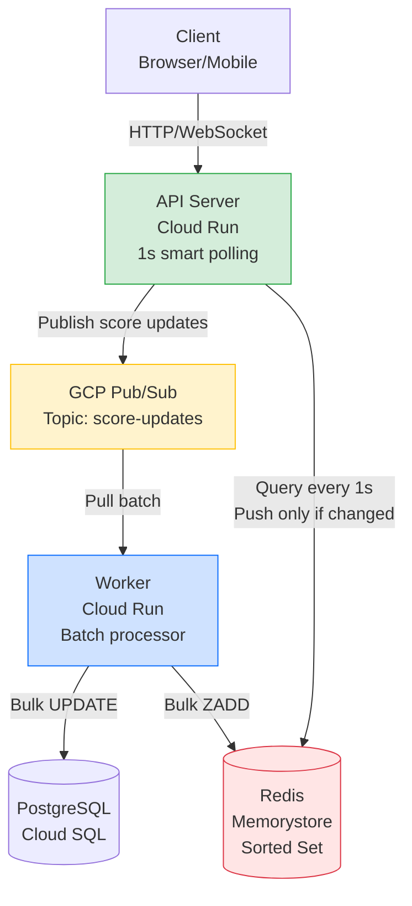
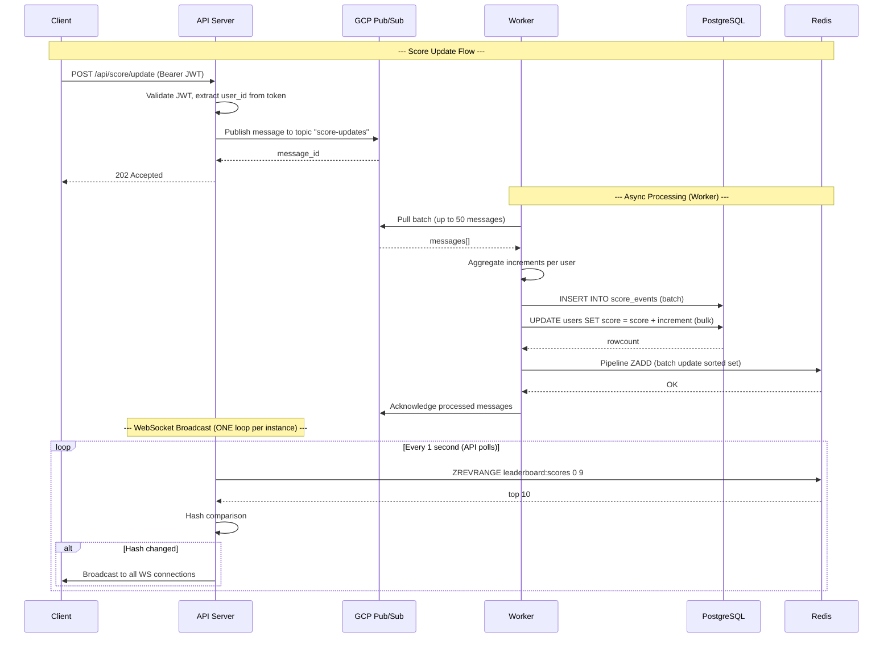
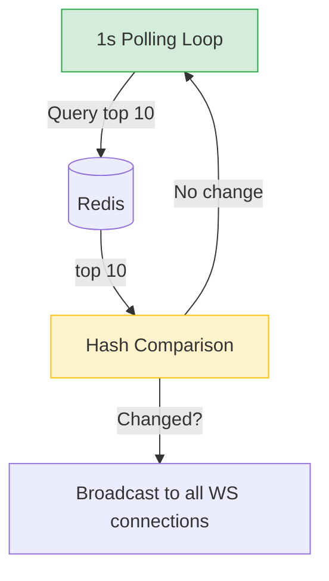

# Real-Time Leaderboard API

## Overview

This is a leaderboard backend that handles score updates and pushes live rankings to clients over WebSocket. Score updates go through GCP Pub/Sub for async processing, and the leaderboard is cached in Redis.

Three main ideas:
- Score updates go to Pub/Sub first, not straight to the database
- Workers batch-process messages and do bulk writes
- API polls Redis every second but only pushes to clients when something actually changed

---

## Architecture

### What we're using



| Component | What it does | GCP Service |
|-----------|--------------|-------------|
| **API Server** | Handles HTTP/WebSocket, validates JWT, publishes to Pub/Sub, polls Redis every 1s | Cloud Run |
| **Worker** | Pulls from Pub/Sub, batch-writes to DB and Redis | Cloud Run |
| **PostgreSQL** | Stores user accounts and scores | Cloud SQL |
| **Redis** | Leaderboard cache using Sorted Set | Memorystore |
| **Pub/Sub** | Message queue for score updates | GCP Pub/Sub |
| **Load Balancer** | Routes traffic to API instances | Cloud Load Balancing |
| **Secrets** | Stores SECRET_KEY, DB credentials | Secret Manager |

### Why Pub/Sub instead of writing directly to DB?

- **Handles spikes:** If 10k requests come in at once, Pub/Sub buffers them. Worker processes at a safe rate.
- **Fast responses:** Publishing to Pub/Sub is faster than writing directly to the database. Users don't wait.
- **Batching:** If same user sends +10, +5, +3, worker combines them into one write (+18).
- **Fault tolerance:** If DB is down, messages stay in Pub/Sub and retry automatically.

### Why Redis instead of just querying PostgreSQL?

- **In-memory:** Redis is in RAM. PostgreSQL is on disk. Even with caching, PostgreSQL has WAL overhead.
- **Built for this:** Redis Sorted Set is literally designed for leaderboards. PostgreSQL needs index scan + sort.
- **No lock contention:** API reads from Redis. Worker writes to PostgreSQL. They don't fight for locks.
- PostgreSQL = source of truth. Redis = fast cache.

### Why poll every 1 second instead of pushing on every update?

- **Batching:** If 100 updates happen in 1 second, we only push once.
- **Less bandwidth:** Saves 99% of the pushes.
- **Simpler:** No need for Redis Pub/Sub or complex event broadcasting.
- **Good enough:** 1 second latency is fine for a leaderboard.

### How score updates flow through the system

Three steps:

1. **API gets request** → Checks JWT, publishes to Pub/Sub, returns 202 immediately
2. **Worker processes batch** → Pulls up to 50 messages, aggregates them, writes to DB and Redis
3. **WebSocket broadcast** → Client connects to `WS /ws`. API polls Redis every second and only broadcasts when leaderboard actually changed.



### WebSocket broadcast model

Each API instance runs ONE polling loop. Not one per connection - just one per server instance.

Every second:
1. Query Redis for top 10
2. Hash the results
3. Compare with previous hash
4. Changed? Broadcast to all WebSocket clients on that instance
5. Not changed? Do nothing



**Performance:**
- 10 API instances = 10 queries/sec to Redis (not 10,000)
- 1,000 connected clients across 10 instances = still just 10 queries/sec
- When leaderboard changes, each instance broadcasts to ~100 connections

---

## API Endpoints

### HTTP

| Method | Path | Auth | Description | Response |
|--------|------|------|-------------|----------|
| `GET` | `/` | None | Health check | `{status, service, instance}` |
| `POST` | `/api/score/update` | Bearer JWT | Submit score update | `202 {status, message, user_id, increment}` |
| `GET` | `/api/leaderboard` | None | Get top 10 (joins Redis with DB for usernames) | `[{rank, username, score}]` |

### WebSocket

| Path | What it does |
|------|--------------|
| `WS /ws` | Sends current top-10 on connect. Then pushes updates every 1 second (only when leaderboard changed). |

---

## Authentication

**Why do we need this?**

Without auth, anyone could submit score updates for any user. Bad actors could manipulate the leaderboard. JWT tokens ensure users can only update their own scores.

| Thing | Value |
|-------|-------|
| Algorithm | HS256 (HMAC-SHA256) |
| Library | `jose` (Node.js) or equivalent for your runtime |
| Token lifetime | 24 hours |
| Token payload | `{sub: user_id, exp: timestamp}` |
| Secret storage | GCP Secret Manager |

**How it works:**
1. User registers/logs in → gets JWT token
2. User sends score update with `Bearer <token>` header
3. API validates token and extracts `user_id` from the token
4. API publishes message with that `user_id` to Pub/Sub

---

## Data Model

### PostgreSQL

**`users` table:**
- `id` (primary key)
- `username` (unique, indexed)
- `score` (aggregated total)

**`score_events` table:**
- `id` (primary key)
- `user_id` (foreign key, indexed)
- `score_increment` (+10, +5, etc.)
- `created_at` (timestamp)

**Why store events?**
- Audit trail - see who scored what and when
- Fraud detection - catch suspicious patterns
- Analytics - analyze scoring trends

**Write strategy:**
Worker writes to both tables in one transaction:
1. INSERT into score_events (one row per event)
2. UPDATE users.score (aggregate)

### Redis

| Key | Type | What for |
|-----|------|----------|
| `leaderboard:scores` | Sorted Set | Members = user_ids, scores = user scores. Fast O(log N) ranking. |

Note: We're NOT using Redis Pub/Sub. API just queries Redis directly.

### GCP Pub/Sub

**Resources:**
- `score-updates` - main topic
- `score-updates-worker-sub` - pull subscription
- `score-updates-dlq` - dead letter queue for failed messages

**Message format:**

```json
{
  "user_id": 42,
  "score_increment": 10,
  "timestamp": 1700000000.123,
  "event_type": "score_update"
}
```

---

## Worker Processing

**What it does:**
- Pulls up to 50 messages from Pub/Sub
- Aggregates them per user (e.g., user 42 has +10, +20, +30 → becomes +60)
- Inserts all events into `score_events` table
- Bulk updates `users.score` (sorts user_ids first to prevent deadlocks)
- Bulk updates Redis using pipeline
- Acks messages if successful, nacks if failed

**Configuration (Cloud Run):**
- Set `--cpu-always-allocated` so the pull loop keeps running
- Set `--min-instances=1` (can't scale to zero with pull subscriptions)
- Scales up based on CPU/memory when processing large batches

**Failure handling:**
- Max 5 delivery attempts
- After 5 failures, message goes to dead-letter queue
- Dead-letter queue holds messages for manual review

---

## Scaling

**API Server (Cloud Run):**
- Auto-scales on request concurrency
- Bump max instances if you see latency spikes

**Worker (Cloud Run):**
- Set `--min-instances=1` and `--cpu-always-allocated`
- Scales up on CPU/memory when processing batches
- Watch "oldest unacked message age" in Pub/Sub metrics

**PostgreSQL (Cloud SQL):**
- Scale up vCPU/RAM when CPU hits 80%
- Add read replicas if you need more read capacity

**Redis (Memorystore):**
- Start with 5GB standard tier
- Scale up when memory usage hits 80%
- Monitor memory usage and eviction count

**Why 5GB?** Not because the leaderboard needs it (100k users = ~10MB). GCP Memorystore Standard tier minimum is 5GB. We use Standard tier because it gives us HA with multi-zone replication and automatic failover. Basic tier (1-4GB) has no HA.

**Pub/Sub:**
- Fully managed, handles up to 10k msg/sec per topic
- No configuration needed unless you hit the limit

---
